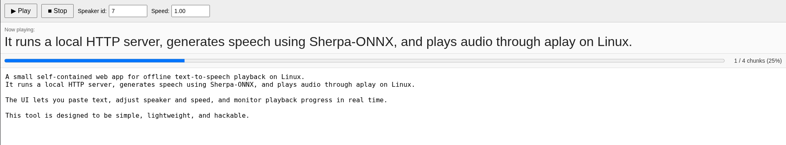

# Local Linux TTS Web Player (Go + Sherpa-ONNX)

A small self‑contained web app for **offline text‑to‑speech playback** on Linux.  
It runs a local HTTP server, generates speech using **Sherpa‑ONNX**, and plays audio through **aplay** on Linux.

The UI lets you paste text, adjust speaker and speed, and monitor playback progress in real time.

This tool is designed to be simple, lightweight, and easy to hack.

---

## Features

- Fully **offline TTS**
- Simple **web interface**
- **Sentence‑by‑sentence playback**
- Adjustable **speaker ID**
- Adjustable **speech speed**
- Live **progress bar**
- Shows **currently spoken sentence**
- Optional **startup text file**
- No database, frameworks, or external services

---

## Screenshot



---


## Requirements

- Linux
- Go **1.22+**
- `alsa-utils` (provides `aplay`)
- Sherpa‑ONNX Go bindings
- A compatible TTS model


---

## Install

Clone the repository:

```sh
git clone git@github.com:wasmup/go-speak.git
cd go-speak


go install -trimpath -ldflags=-s

# build:
GOAMD64=v1 go build -trimpath -ldflags="-s -w" -o ~/tts/go-speak
./build-deb.sh 
# install
sudo dpkg -i build/go-speak_1.0.1_amd64.deb

# run
/opt/go-speak/go-speak -m /opt/go-speak

sha256sum build/go-speak_1.0.1_amd64.deb
# 68c30233a4469a8a9e5b01c67b749fa1204101715a8694ae58754f1ddc73ac70  build/go-speak_1.0.1_amd64.deb

sha256sum /opt/go-speak/go-speak
# 1191a93dfeacbc071288749b90daa17afeac04ac12d4de985b8f2daa0d412c23  /opt/go-speak/go-speak

dpkg-deb -f build/go-speak_1.0.1_amd64.deb
# Package: go-speak
# Version: 1.0.1
# Section: sound
# Priority: optional
# Architecture: amd64
# Maintainer: wasmup
# Depends: alsa-utils
# Description: Offline TTS web player using Sherpa-ONNX
#  Lightweight local web UI for text-to-speech playback.
#  Uses Sherpa-ONNX and plays audio via aplay.

go version -m /opt/go-speak/go-speak
# /opt/go-speak/go-speak: go1.26.4
#         path    go-speak
#         mod     go-speak        v1.0.1-0.20260620065611-0d9e803af4e6
#         dep     github.com/k2-fsa/sherpa-onnx-go-linux  v1.13.3 h1:FuO/vw+vBgS/wRJDTOMy2ikJdHRhWvleqpdjvSOnzYA=
#         build   -buildmode=exe
#         build   -compiler=gc
#         build   -trimpath=true
#         build   CGO_ENABLED=1
#         build   GOARCH=amd64
#         build   GOOS=linux
#         build   GOAMD64=v1
#         build   vcs=git
#         build   vcs.revision=0d9e803af4e61a129a04f5d1275ccb13b3a36170
#         build   vcs.time=2026-06-20T06:56:11Z
#         build   vcs.modified=false

```

---

## Model Setup

Download a Sherpa‑ONNX Piper TTS [model](https://github.com/k2-fsa/sherpa-onnx/releases/tag/tts-models), for example:


```sh
mkdir ~/tts
cd ~/tts

wget -c https://github.com/k2-fsa/sherpa-onnx/releases/download/tts-models/vits-piper-en_US-libritts_r-medium.tar.bz2
tar -xjf vits-piper-en_US-libritts_r-medium.tar.bz2

```

Expected directory layout:

```

~/tts/
└── vits-piper-en_US-libritts_r-medium
    ├── en_US-libritts_r-medium.onnx
    ├── tokens.txt
    └── espeak-ng-data/
```

Default model directory:

```
~/tts
```

You can override it with `-m`.

---

## Running

```
go-speak
```

Open your browser:

```
http://127.0.0.1:8080
```

---

## Command Line Options

```
-addr   HTTP listen address
-i      Startup text file (optional)
-m      TTS model directory
-sid    Default speaker ID
-speed  Default speech speed
```

Example:

```
./go-speak \
  -addr 127.0.0.1:8080 \
  -m ~/tts \
  -sid 7 \
  -speed 1.0
```

Load a startup text:

```
./go-speak -i speech.txt
```

---

## Web Interface

Controls:

**Play**  
Start speaking the text.

**Stop**  
Stop playback immediately.

**Speaker ID**  
Select the voice speaker (depends on the model).

**Speed**  
Adjust speech speed (0.2 – 4.0).

---

## How It Works

1. The text is split into sentences.
2. Each sentence is synthesized using Sherpa‑ONNX.
3. Generated audio is streamed to `aplay`.
4. The browser polls `/progress` to update UI state.

Playback runs in a background goroutine with cancellation support.

---

## HTTP API

### `POST /play`

**Exclude chars**

Characters entered here are removed from the text before playback.
Example: `*#`

Start playback.

Form parameters:

```
text=Hello world.
exclude=*#
```

Response:

```
{
  "text": "Hello world."
}
```

---

### `POST /stop`

Stop playback.

---

### `GET /progress`

Returns playback status.

Example:

```
{
  "done": 2,
  "total": 5,
  "playing": true,
  "percent": 40,
  "current": "This is the sentence being spoken."
}
```

---

### `POST /set_sid`

Set speaker ID.

```
sid=7
```

---

### `POST /set_speed`

Set speech speed.

```
speed=1.2
```

Allowed range:

```
0.2 – 4.0
```

---

## Project Structure

```
main.go        server startup
app.go         application state and playback loop
handlers.go    HTTP handlers
progress.go    progress tracking
audio.go       audio playback via aplay
tts.go         Sherpa TTS initialization
config.go      CLI flags and configuration
sentences.go   sentence splitting
index.html     embedded web UI
```

---

## Design Goals

- Minimal dependencies
- Easy to understand
- Easy to modify
- Fully offline
- Small codebase

---

## Known Limitations

- Only tested with Piper VITS models.
- Playback currently depends on `aplay` (ALSA).
- Sentence splitting is simple and punctuation‑based (. ! ?). Abbreviations such as "Dr." are not handled.

---

## License

MIT License
